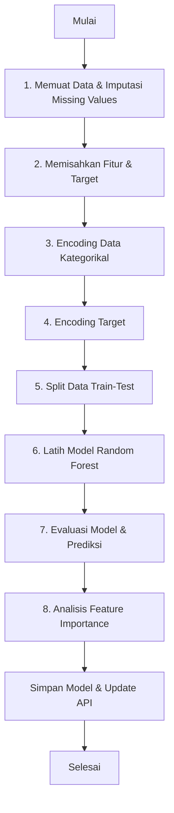

# Rencana Perombakan Sistem Rekomendasi Varietas Tanaman (Random Forest)

Dokumen ini berisi perencanaan lengkap untuk merombak sistem rekomendasi varietas tanaman hortikultura yang ada. Perombakan ini didasarkan pada dataset baru di `data2/dataset_training_random_forest_generated.csv`, beralih dari pendekatan klasifikasi tidak langsung (klasifikasi kecamatan -> pencarian kesamaan) ke **klasifikasi klasifikasi langsung (Direct Variety Classification)** menggunakan algoritma **Random Forest Classifier**.

---

## 1. Latar Belakang & Analisis Masalah

### Sistem Lama:
1. **Model Klasifikasi Kecamatan**: Model melatih Random Forest untuk memprediksi `Kecamatan` berdasarkan atribut lingkungan.
2. **Peringkat Varietas Blended**: Menggunakan formula hibrida (60% kecocokan probabilitas lokasi Kecamatan dari model + 40% kemiripan Euclidean jarak fitur lingkungan terhadap rata-rata varietas) untuk merekomendasikan varietas.
3. **Keterbatasan**: Kurang efisien, tidak melatih model secara langsung untuk mempelajari hubungan spesifik antara parameter lingkungan + jenis tanaman dengan varietas yang paling cocok secara statistik.

### Sistem Baru (Perombakan):
1. **Klasifikasi Varietas Langsung**: Melatih model `RandomForestClassifier` untuk langsung memprediksi `Nama_Varietas` yang paling cocok sebagai target (`y`) berdasarkan gabungan jenis tanaman (`Nama_Tanaman`) dan seluruh parameter lingkungan sebagai fitur (`X`).
2. **Menangani Data Hilang (Missing Values)**: Dataset baru memiliki **90 data kosong (NaN)** pada kolom `Suhu_C` di Kecamatan *Tanah Pasir*, *Muara Batu*, dan *Dewantara*. Kita akan mengimputasi data kosong ini dengan nilai median/rata-rata global atau regional sebelum pelatihan.
3. **Alur ML End-to-End yang Terstandarisasi**: Mengikuti 8 tahapan terstruktur yang diminta.

---

## 2. Tahapan Perombakan Sistem

Berikut adalah rencana 8 tahapan implementasi yang akan diintegrasikan ke dalam kode program:

---

### Tahap 1: Memisahkan Fitur dan Target (Feature & Target Separation)
Memisahkan kolom-kolom masukan (fitur) dan kolom keluaran (target) dari dataset `data2/dataset_training_random_forest_generated.csv`.

*   **Fitur ($X$)**:
    *   `Nama_Tanaman` (Jenis tanaman hortikultura)
    *   `Kecamatan` (Kondisi geografis makro/lokasi)
    *   `pH_Tanah` (Kandungan keasaman tanah)
    *   `Suhu_C` (Suhu rata-rata udara)
    *   `Curah_Hujan_mm` (Curah hujan tahunan)
    *   `Elevasi_mdpl` (Ketinggian lokasi dari permukaan laut)
    *   `Ketersediaan_Air` (Tingkat pasokan air)
    *   `Intensitas_Matahari_jam` (Jumlah paparan matahari harian)
*   **Target ($y$)**:
    *   `Nama_Varietas` (Varietas spesifik tanaman hortikultura)

---

### Tahap 2: Encoding Data Kategorikal (Categorical Feature Encoding)
Fitur-fitur bertipe teks/kategori harus dikonversi ke nilai numerik agar dapat diproses oleh Random Forest:

1.  **`Ketersediaan_Air` (Ordinal Encoding)**:
    Karena memiliki tingkatan logis, kita melakukan pemetaan manual secara ordinal:
    $$\text{Rendah} \rightarrow 0,\quad \text{Sedang} \rightarrow 1,\quad \text{Tinggi} \rightarrow 2$$
2.  **`Nama_Tanaman` (Label Encoding)**:
    Menggunakan `LabelEncoder` untuk mengubah nama tanaman menjadi indeks numerik (misal: *Ketimun* $\rightarrow 0$, *Kacang Panjang* $\rightarrow 1$, dst.). Encodernya disimpan sebagai `le_tanaman.joblib`.
3.  **`Kecamatan` (Label Encoding)**:
    Menggunakan `LabelEncoder` untuk mengubah nama kecamatan menjadi indeks numerik. Encodernya disimpan sebagai `le_kecamatan.joblib`.

---

### Tahap 3: Encoding Target (Target Encoding)
Target klasifikasi `Nama_Varietas` berisi string nama varietas unggul (misal: *Hercules F1*, *Servo F1*, *Maestro*, dll.).
*   Menggunakan `LabelEncoder` khusus target untuk memetakan nama varietas ke integer terurut.
*   Encoder disimpan sebagai `le_varietas.joblib` untuk membalikkan hasil prediksi numerik kembali menjadi nama varietas asli saat inferensi/pengujian.

---

### Tahap 4: Split Data Train-Test (Train-Test Split)
Membagi dataset menjadi set pelatihan (train) dan pengujian (test) dengan rasio **80% untuk Train** dan **20% untuk Test**.
*   **Stratifikasi (`stratify=y`)**: Sangat krusial karena kita melakukan klasifikasi multi-kelas dengan banyak varietas. Stratifikasi menjamin bahwa set pengujian memiliki proporsi kelas varietas yang sama persis dengan set pelatihan, mencegah hilangnya perwakilan varietas langka di data uji.
*   **Random State**: Menggunakan seed tetap (`random_state=42`) untuk menjamin hasil split yang konsisten dan dapat direproduksi.

---

### Tahap 5: Latih Random Forest (Model Training)
Melatih model `RandomForestClassifier` dari pustaka `scikit-learn`.
*   **Parameter Utama**:
    *   `n_estimators=100` (Jumlah pohon keputusan dalam forest)
    *   `random_state=42` (Seed keacakan untuk replikasi)
    *   `max_depth=None` atau kedalaman yang dioptimalkan untuk mencegah overfitting.
*   Model yang telah dilatih disimpan ke `models/random_forest_model.joblib`.

---

### Tahap 6: Prediksi (Inference / Prediction)
Mekanisme prediksi baru akan mendukung dua skenario:
1.  **Prediksi Data Uji**: Memprediksi set `X_test` untuk mengevaluasi akurasi model.
2.  **Rekomendasi Varietas Dinamis**:
    *   Pengguna memasukkan parameter lingkungan (`pH`, `Suhu`, dll.) dan jenis tanaman (`Nama_Tanaman`).
    *   Model secara langsung mengeluarkan probabilitas klasifikasi varietas yang paling cocok.
    *   Mendukung rekomendasi multi-tanaman sekaligus: Untuk lingkungan yang diberikan, model dapat memprediksi varietas terbaik untuk ke-9 jenis tanaman hortikultura secara efisien dengan melakukan iterasi pada input `Nama_Tanaman`.

---

### Tahap 7: Evaluasi (Evaluation Metrics)
Mengukur kualitas model secara komprehensif menggunakan metrik-metrik standar:
*   **Akurasi Keseluruhan (Overall Accuracy)**: Persentase prediksi varietas yang tepat pada data uji.
*   **Classification Report**:
    *   **Precision**: Mengukur ketepatan prediksi untuk setiap varietas.
    *   **Recall**: Mengukur kemampuan model mendeteksi varietas tersebut dari data aktual.
    *   **F1-Score**: Rata-rata harmonis antara precision dan recall.
*   **Confusion Matrix**: Visualisasi tabel kontingensi untuk mendeteksi varietas mana yang sering tertukar atau mengalami misklasifikasi.

---

### Tahap 8: Feature Importance (Analisis Kontribusi Fitur)
Mengekstrak atribut `feature_importances_` dari model Random Forest yang dilatih.
*   Menganalisis dan mengurutkan fitur lingkungan mana yang paling berpengaruh dalam menentukan kecocokan varietas tanaman (misalnya, apakah `pH_Tanah` lebih berpengaruh daripada `Suhu_C` atau `Elevasi_mdpl`).
*   Menyajikan hasil analisis ini dalam bentuk tabel persentase kontribusi fitur yang informatif.

---

## 3. Rencana Perubahan Kode & File

Untuk merealisasikan rencana ini, file-file lama dalam direktori `src/` akan dirombak total dan disederhanakan:

| File | Status | Keterangan Perubahan |
| :--- | :---: | :--- |
| `data2/processed_dataset.csv` | **[NEW]** | File data hasil preprocessing dari dataset baru (termasuk imputasi `Suhu_C` yang kosong). |
| `src/data_preprocessing.py` | **[MODIFY]** | Diubah untuk membaca `data2/...generated.csv`, mengimputasi NaN pada `Suhu_C` dengan median global, memisahkan fitur/target, dan menyimpan encoder baru. |
| `src/train_model.py` | **[MODIFY]** | Diubah untuk menggunakan target `Nama_Varietas_Encoded` (bukan Kecamatan) dan fitur lengkap (termasuk `Nama_Tanaman_Encoded` & `Kecamatan_Encoded`). |
| `src/evaluate_model.py` | **[MODIFY]** | Diubah untuk mengevaluasi model prediksi varietas langsung, mencetak classification report varietas, dan menampilkan Feature Importance. |
| `src/predict.py` | **[MODIFY]** | Diubah total agar langsung merekomendasikan varietas tanaman berdasarkan model Random Forest baru, menghilangkan formula hibrida lama yang tidak efisien. |
| `src/api.py` | **[MODIFY]** | Memperbarui endpoint `/predict` agar terintegrasi penuh dengan pipeline klasifikasi varietas langsung. |
| `src/check_uniqueness.py` | **[DELETE]** | Dihapus jika tidak lagi relevan dengan alur klasifikasi langsung. |
| `src/test_accuracy.py` | **[DELETE]** | Dihapus karena fungsinya sudah disatukan di `src/evaluate_model.py`. |

---

## 4. Rencana Verifikasi (Verification Plan)

Akurasi sistem baru akan diuji secara lokal menggunakan skrip evaluasi:
1.  **Akurasi Klasifikasi**: Target akurasi pada set pengujian minimal **90%** karena Random Forest sangat andal untuk data tabular terstruktur.
2.  **API Swagger Testing**: Uji endpoint `/predict` di FastAPI lewat `http://localhost:8000/docs` untuk memastikan input JSON diproses dengan benar dan menghasilkan rekomendasi varietas yang sesuai.
3.  **Visualisasi Kontribusi**: Memastikan output Feature Importance tercetak dengan format persentase yang rapi.
